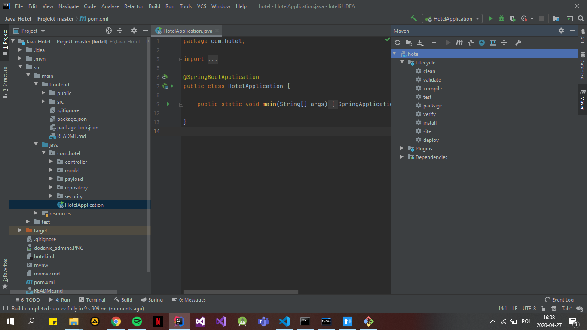
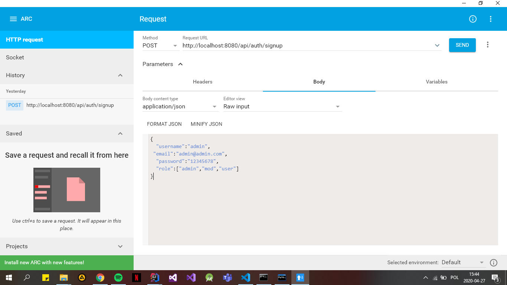

# System do zarządzania hotelem

## Pierwsze uruchomienie
- pobieramy projekt z gita
- otweramy projekt w intelliji
- nastepnie wykonujemy package na projekcie maven, jak na zdjęciu, klikamy w package. 

- Prawdopodobnie pokaże się błąd. Będzie to spowodowane brakiem bazy danych, więc przejdź do punktu Baza danych
- Ale dzięki package powinny doinstalować się nam wszystkie dodatkowe pluginy, także w frontendzie
- Możemy zobaczyć już aplikację -> patrz punkt Uruchomienie
- Po dodaniu bazy danych, doinstalowaniu pluginów i dodaniu admina, powinniśmy móc się zalgować już przez GUI

## Miłej pracy! 

## Doinstalowanie:
Możliwe, ze nie wszystko się pobierze automatycznie. Wykryte problemy:
- lombok -  doinstalować w intellij File->Settings->Plugins i tam w marketplace wyszukać lombok
- Należy sciągnąć osobiście Node.js i tamtego command line używać do uruchamiania frontendu

## Baza danych:
Używany jest MySQL
Należy utowrzyć sobie baze danych o nazwie hoteldb
W ustawienich ustawić serverTimezone jako UTC
w pliku src/main/resources/application.properties znajdują sie informacje.
Logujemy się jako root, proszę wpisać takie jakie macie własne ustawione.

## Dodanie admina:
W bazie danych dodajemy role (to tak poczatkowo tylko):
```
INSERT INTO roles(name) VALUES('ROLE_USER');
INSERT INTO roles(name) VALUES('ROLE_MODERATOR');
INSERT INTO roles(name) VALUES('ROLE_ADMIN');
```
Jeszcze nie ma zrobione, aby admin byl automatycznie dodawany do bazy, 
dlatego nalezy to zrobić osobiście. Jest to tak zrobione jak pod koniec
tego kursu: https://bezkoder.com/spring-boot-jwt-authentication/

Musimy posiadac aplikcję, ktora wysyła nam zapytania REST
 ( na google chrome program Advenced Rest Controller) i wysyłamy rejestracje admina
 jak na zdjęciu: 
  
 
 W bazie powinien być już admin dzięk któremu się logujemy

## Uruchamianie:
- Aby udostępnić API, należy uruchomić HotelApplication, na localhost:8080

- w katalogu src/main/java/frontend poprzez node.js wpisać komendę: 
```
npm start
```
Uruchomi się nam localhost:3000, na którym będą pokazywać się zmiany robione w aplikacji React

## Budowanie pliku jar:
- należy w katalogu src/main/java/frontend poprzez node.js wpisać komendę:
```
npm run build
```
- następnie wykonać clean i package na projekcie maven.
- po tych operacjach możemy uruchomić połączony back i front na localhost:8080 
java -jar <ściażeka do pliku jar>
